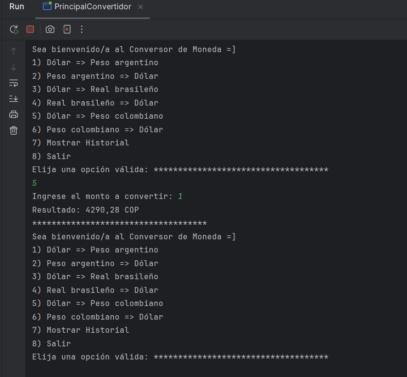
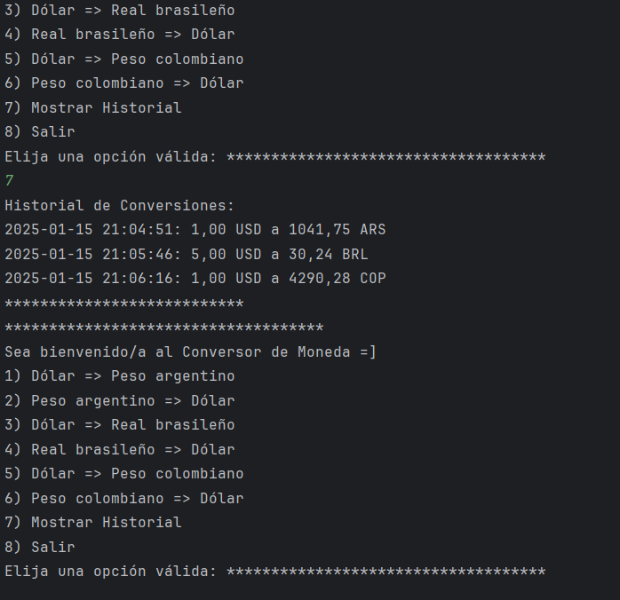

# Conversor de Moneda 💱

Este es un proyecto realizado como parte del Challenge **ONE Backend con Java** de [Alura Latam](https://www.aluracursos.com/). La aplicación permite realizar conversiones de monedas en una interfaz de consola sencilla e intuitiva. Además, incluye un historial de conversiones que facilita el seguimiento de los cálculos realizados.

## 📋 Funcionalidades principales

1. **Conversión de monedas**:
   - Dólar a Peso argentino
   - Peso argentino a Dólar
   - Dólar a Real brasileño
   - Real brasileño a Dólar
   - Dólar a Peso colombiano
   - Peso colombiano a Dólar

2. **Historial de conversiones**:
   - Visualización de todas las transacciones realizadas, mostrando la fecha, hora, monto inicial, tipo de cambio y resultado.

3. **Consumo de una API**:
   - El programa obtiene las tasas de cambio en tiempo real mediante la API de *Exchange Rate*.

4. **Interfaz interactiva en consola**:
   - Menús y opciones claros que guían a la persona usuaria paso a paso.

---

## 🌟 Capturas de pantalla

### Menú principal

En esta captura se muestra el menú principal donde puedes elegir entre las opciones de conversión disponibles o salir del programa.

### Historial de conversiones

Aquí puedes observar el historial completo de conversiones realizadas, con detalles como el monto convertido y la tasa de cambio utilizada.

---

## 🔧 Requisitos del proyecto

- Conocimientos básicos de Java.
- Experiencia en programación orientada a objetos (POO).
- Familiaridad con el consumo de APIs utilizando Java.

---

## 🛠 Tecnologías utilizadas

- **Lenguaje**: Java
- **Entorno de desarrollo**: IntelliJ IDEA
- **API**: Exchange Rate
- **Control de versiones**: Git y GitHub

---

